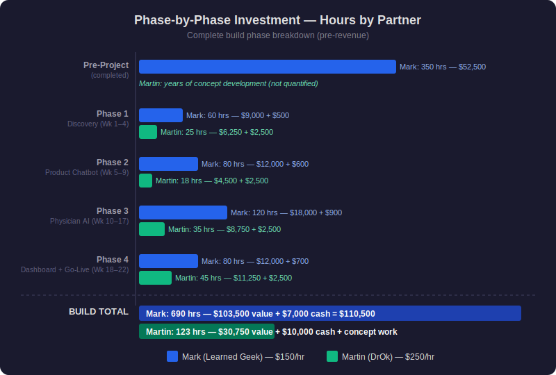
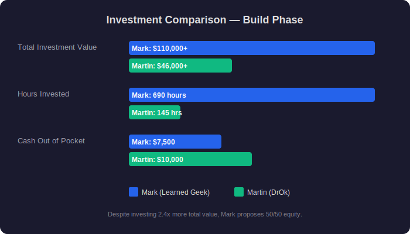
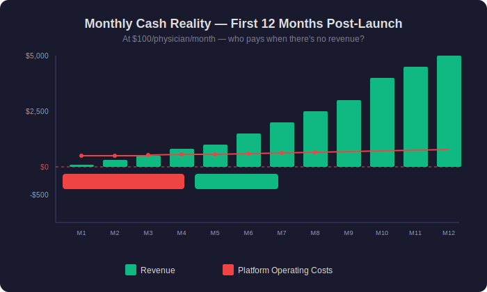
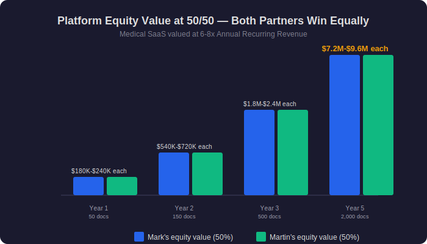

# Reply to Martin — March 30, 2026
## Response to his inline comments on the term sheet

**From:** Mark McArthey (markm@learnedgeek.com)
**To:** Martin Nunez
**Subject:** Re: DrOk Partnership — Moving Forward Together

---

Martin,

Thank you for your thoughtful response. I appreciate that you took the time to review everything carefully and share your honest perspective. This is exactly the kind of conversation we need to have — openly and directly — before we formalize anything.

You asked to see the complete investment picture and a Gantt that phases the process. You're absolutely right — we should both have full transparency before finalizing anything. Let me start with where we agree, then walk through the full picture together.

---

## 1. Where We Already Agree

**Carlos:** We agree. Carlos will be compensated fairly for his invaluable expertise. ✅

**Partnership:** We both want this to work. We both see the potential. You asked to see the complete investment and build a Gantt — and you're right to ask. What follows is exactly that: every phase, every task, every hour, every cost, for both of us.

---

## 2. The Full Investment Picture

You asked to see the complete investment and build a Gantt that lets us phase the process. Here it is — total transparency for both sides.

A note on how I valued our time:

- **My technical work:** `$150/hour` — standard for a senior full-stack developer with AI and cloud architecture experience.
- **Your time:** `$250/hour` — the rate of a Harvard and Cayetano Heredia-trained physician with regulatory expertise and a clinical network.

That rate reflects what your time is genuinely worth.

---

### Pre-Project Investment (Already Completed)

Before we discussed a partnership, I had already invested significantly to make this platform possible:

| Mark's Completed Work | Hours | Value |
|---|---|---|
| AI safety research & confabulation taxonomy (ANI project) | 120 | $18,000 |
| Working proof of concept (Twilio + Claude API + PubMed) | 100 | $15,000 |
| Legal document drafting (NDA, DPA, SOW, Operating Agreement) | 50 | $7,500 |
| Regulatory research (Ley 29733, DIGEMID, Ley 32314) | 40 | $6,000 |
| Architecture decisions & vendor evaluation | 40 | $6,000 |
| **Subtotal — Mark's pre-project** | **350 hrs** | **$52,500** |
| **Cash spent** (hosting, APIs, insurance, legal tools) | | **$4,300** |

Your contributions during this period — years of concept development, conversations with operators, and the clinical vision that drives this project — are foundational. That work doesn't fit neatly into an hours table, and I don't think it's right to try. What I can say is this: your years of persistence are the reason this project exists at all. The tables below capture what we can measure, but they don't capture everything.

My pre-project investment is already spent regardless of what we decide. I'm not asking you to pay for it. But it's part of the full picture.

---

### Phase 1 — Discovery & Specification (Weeks 1–4)

| Mark's Deliverables | Hrs | Martin's Deliverables | Hrs |
|---|---|---|---|
| Requirements mapping & data flow diagrams | 15 | Clinical requirements & physician workflow | 8 |
| Cloud architecture setup (Azure) | 12 | Emergency protocol definition | 6 |
| Legal framework finalization | 10 | Regulatory guidance (DIGEMID, Ley 29733) | 5 |
| Compliance documentation | 8 | Product documentation (Infanzia catalog) | 4 |
| Security architecture design | 8 | Review & feedback on technical specs | 2 |
| CI/CD pipeline configuration | 7 | | |
| **Subtotal** | **60 hrs** | **Subtotal** | **25 hrs** |
| Value: $9,000 + $500 cash | | Value: $6,250 + $2,500 cash | |

---

### Phase 2 — Infanzia Product Chatbot (Weeks 5–9)

| Mark's Deliverables | Hrs | Martin's Deliverables | Hrs |
|---|---|---|---|
| Knowledge base ingestion system | 20 | Product catalog content & documentation | 6 |
| WhatsApp conversation engine | 20 | Clinical review of AI responses | 5 |
| Twilio integration & message handling | 15 | UAT testing scenarios | 4 |
| Blazor admin interface | 15 | Feedback & corrections | 3 |
| Testing & deployment | 10 | | |
| **Subtotal** | **80 hrs** | **Subtotal** | **18 hrs** |
| Value: $12,000 + $600 cash | | Value: $4,500 + $2,500 cash | |

---

### Phase 3 — Physician AI Triage System (Weeks 10–17)

This is the technical core of the platform — where both the engineering and the clinical expertise are most critical.

| Mark's Deliverables | Hrs | Martin's Deliverables | Hrs |
|---|---|---|---|
| Data model & API layer | 25 | Emergency keyword list (Spanish medical terms) | 10 |
| Conversation engine (Claude API integration) | 20 | Clinical validation protocols | 9 |
| Emergency detection system | 15 | Triage accuracy review & testing | 7 |
| PubMed RAG (medical literature retrieval) | 15 | Physician onboarding flow design | 5 |
| VoBo — physician approval workflow | 15 | Clinical test case scenarios | 4 |
| Image handling & secure storage | 10 | | |
| Encryption & security layer | 10 | | |
| Integration testing | 10 | | |
| **Subtotal** | **120 hrs** | **Subtotal** | **35 hrs** |
| Value: $18,000 + $900 cash | | Value: $8,750 + $2,500 cash | |

---

### Phase 4 — Physician Dashboard & Go-Live (Weeks 18–22)

| Mark's Deliverables | Hrs | Martin's Deliverables | Hrs |
|---|---|---|---|
| Physician dashboard (web application) | 25 | UAT with real clinical scenarios | 14 |
| Queue management system | 15 | Pilot setup (Martin as first physician) | 10 |
| Patient history & transcript viewer | 15 | Physician recruitment (first 5–10) | 10 |
| Production deployment & monitoring | 10 | Onboarding materials for physicians | 6 |
| Go-live checklist & security audit | 8 | Regulatory submissions (if required) | 5 |
| SSL/TLS, domain, DNS configuration | 7 | | |
| **Subtotal** | **80 hrs** | **Subtotal** | **45 hrs** |
| Value: $12,000 + $700 cash | | Value: $11,250 + $2,500 cash | |

---

### Post-Launch — Year 1 Ongoing Operations

After launch, both of us continue contributing. The platform doesn't run itself.

| Mark's Ongoing Responsibilities | Hrs/Yr | Martin's Ongoing Responsibilities | Hrs/Yr |
|---|---|---|---|
| Platform monitoring & uptime (24/7) | 100 | Physician recruitment & onboarding | 80 |
| Security patches & updates | 80 | Clinical validation of AI responses | 60 |
| Bug fixes & feature development | 120 | Regulatory navigation & compliance | 30 |
| Database management & backups | 60 | Brand development & marketing | 30 |
| API cost management & optimization | 40 | Network expansion | 25 |
| Compliance updates | 40 | Medical protocol updates | 15 |
| Insurance maintenance & renewal | 20 | | |
| Server & infrastructure management | 60 | | |
| **Year 1 total** | **~520 hrs** | **Year 1 total** | **~240 hrs** |
| Value: ~$78,000 + ~$6,000 cash | | Value: ~$60,000 | |

---

### Complete Investment Summary — Build Phase (Pre-Revenue)

| Phase | Mark Hours | Mark Value | Martin Hours | Martin Value |
|---|---|---|---|---|
| Pre-Project (completed) | 350 | $52,500 | — | — |
| Phase 1 — Discovery | 60 | $9,000 | 25 | $6,250 |
| Phase 2 — Product Chatbot | 80 | $12,000 | 18 | $4,500 |
| Phase 3 — Physician AI System | 120 | $18,000 | 35 | $8,750 |
| Phase 4 — Dashboard & Go-Live | 80 | $12,000 | 45 | $11,250 |
| **Build phase total** | **690** | **$103,500** | **123** | **$30,750** |

*Martin's years of pre-project concept work and clinical vision are not included in this table — they are foundational to the project but don't reduce to a number.*

| | Mark (Learned Geek) | Martin (DrOk) |
|---|---|---|
| **Build phase hours** | 690 hours | 123 hours + years of concept work |
| **Market value of time** | $103,500 (at $150/hr) | $30,750 (at $250/hr) |
| **Cash out of pocket** | $7,000 | $10,000 (phased) |
| **Total pre-revenue investment** | **$110,500** | **$40,750 + concept work** |

The nature of our contributions is different — and that's the strength of this partnership. Mine is primarily technical build and ongoing operations. Yours is primarily clinical expertise, regulatory navigation, and commercial growth. Both are essential.

---

## 3. Revenue — The Practical Reality

I understand and agree with the principle of reinvestment. Growing the business should absolutely be the priority. But I want to walk through what the first 12 months actually look like financially, because this is where the math gets real:

### Monthly Cash Reality — First 12 Months Post-Launch

| Month | Physicians (est.) | Revenue | Platform Costs | Net Available | Who Pays the Shortfall? |
|---|---|---|---|---|---|
| 1 | 1 (Martin) | $100 | $500 | **-$400** | Mark (out of pocket) |
| 2 | 3 | $300 | $500 | **-$200** | Mark (out of pocket) |
| 3 | 5 | $500 | $525 | **-$25** | Mark (out of pocket) |
| 4 | 8 | $800 | $550 | +$250 | First positive month |
| 5 | 10 | $1,000 | $550 | +$450 | |
| 6 | 15 | $1,500 | $600 | +$900 | |
| 7-9 | 20-25 | $2,000-2,500 | $625-650 | +$1,375-1,850 | |
| 10-12 | 30-50 | $3,000-5,000 | $650-725 | +$2,350-4,275 | |

**For the first 3-4 months, there is no revenue to reinvest.** The platform costs money whether there are 0 physicians or 100. Those costs need to be covered from somewhere while we grow.

This is why I proposed a minimum cost recovery (platform license fee) that comes off the top before any reinvestment: it simply ensures the platform stays running. It's not profit — it's the electric bill.

**My proposal:** We agree on a minimum monthly operating cost recovery (approximately $500-700/month) that covers actual infrastructure costs. Everything above that, we reinvest as aggressively as we both agree makes sense. Once revenue consistently exceeds costs, we can adjust or eliminate the cost recovery and move to pure profit distribution.

---

## 4. Equity — My Proposal

Martin, I've thought about this carefully. My original proposal was 55/45 in my favor. Your counter was 60/40 in yours. We're 20 points apart.

Here is what I'd like to propose: **50/50. True equal partners.**

Not because the math says 50/50 — the numbers above speak for themselves. But because I believe in what we're building, and I believe the success of this project depends **equally** on both of us.

**You are not "just a commercial tool."** I want to be very clear about that. You are:
- The clinical authority that physicians trust
- The person who navigated DIGEMID and Ley 29733
- The person who brought Carlos Rojas to the table
- The person with access to 50-100 physicians from day one
- The Harvard and Cayetano Heredia graduate whose reputation opens doors
- The physician who will validate every AI response before it reaches a patient

Neither of us can do this alone. The platform without physicians is a technology demo. The clinical vision without a platform stays unrealized. **Together, we make something neither of us can build separately. That's what 50/50 means.**

---

## 5. How We're Both Protected — Vesting, Safeguards, and Commitment

Equal equity requires equal protections. A fair partnership means neither of us can lose everything if something goes wrong. I want to propose structural protections that protect **both** of us equally:

### Equity Vesting — Commitment from Both Sides

Rather than giving 50% to each person on day one, equity vests over **24 months with a 6-month cliff.**

What this means in practice:

| Timeline | What Happens |
|---|---|
| **Months 1–6 (cliff)** | Neither partner has vested equity. Both are proving commitment. |
| **Month 6** | Each partner vests 25% of their total equity (12.5% of the company each). |
| **Months 7–24** | Remaining equity vests monthly — approximately 1.4% per month per partner. |
| **Month 24** | Both partners are fully vested at 50/50. |

**Why this protects Martin:** If I stop building or maintaining the platform during the first two years, I don't walk away with 50% of a business I abandoned. You keep your vested share and the right to find another technical partner.

**Why this protects Mark:** If physician recruitment doesn't materialize or the partnership isn't working, I haven't given away half of the platform without the commercial side delivering.

**Why this is fair:** It requires both of us to show up and deliver. Neither of us earns equity by signing a contract — we earn it by doing the work.

### Platform Safeguards — Your Investment Is Protected

The real question isn't "who owns the code?" — it's **"what happens to my investment if something goes wrong?"** Here's how the structure addresses that:

| Scenario | What Happens | Who Is Protected |
|---|---|---|
| **Mark stops maintaining the platform** | Exclusive license to DrOk becomes perpetual and irrevocable; source code escrow releases to DrOk | Martin |
| **Martin stops recruiting physicians** | Exclusivity period lapses; Learned Geek can license to other partners | Mark |
| **Someone wants to acquire the platform** | Both partners have right of first refusal; no sale without mutual agreement | Both |
| **One partner wants to exit** | Remaining partner has right of first refusal on the departing partner's equity | Both |
| **Dispute over direction** | 50/50 requires consensus — neither partner can unilaterally override the other | Both |

### Performance Milestones — Accountability for Both

| Milestone | Timeline | Accountable |
|---|---|---|
| Working MVP deployed | Month 6 | Mark |
| Martin onboarded as pilot physician | Month 6 | Both |
| 10 physicians active | Month 12 | Martin |
| 25 physicians active | Month 18 | Martin |
| Platform uptime > 99.5% | Ongoing | Mark |
| All security patches current | Ongoing | Mark |

If the physician recruitment milestones aren't met, the exclusivity arrangement is renegotiated — not the equity. If the platform milestones aren't met, the same applies. Both of us are accountable for delivering what we committed to.

---

## 6. Intellectual Property — An Operational Decision

With those protections in place, let me address the question I know matters most to you.

I want to start by saying clearly: **this idea is yours.** You conceived it. You've been working on it since before the pandemic. You pursued it through multiple approaches and kept pushing forward. That vision — an AI physician's assistant that helps patients when the doctor isn't available — that is your contribution, and I respect it deeply. Without your idea and your vision, we wouldn't be having this conversation.

Under both US law and Peruvian law, intellectual property protection attaches to the **implementation** — the code, the architecture, the research, the documentation — not to the concept or idea. Peru's Decreto Legislativo 822 and the recent Ley 32314 (2025) are explicit on this point, as is US copyright law. This is the legal reality in both countries.

**But I don't want this to be a legal argument. I want it to be a practical one.**

Someone has to maintain this platform every single day. Consider what happens over the life of this project:

| Ongoing Responsibility | Who Does It | Frequency |
|---|---|---|
| Server hosting and uptime | Mark / Learned Geek | 24/7/365 |
| Security patches and updates | Mark / Learned Geek | Weekly |
| Bug fixes (including 2am emergencies) | Mark / Learned Geek | Ongoing |
| AI API costs (Anthropic, PubMed) | Mark / Learned Geek | Monthly |
| Messaging costs (Twilio/WhatsApp) | Mark / Learned Geek | Monthly |
| Professional liability insurance | Mark / Learned Geek | Annual |
| Cyber liability insurance | Mark / Learned Geek | Annual |
| Feature development and improvements | Mark / Learned Geek | Ongoing |
| Database management and backups | Mark / Learned Geek | Daily |
| Compliance updates (Ley 29733, ARCO) | Mark / Learned Geek | As required |

The entity that maintains, secures, insures, and operates the platform needs to be the entity responsible for it. That's not about taking something away from you — it's about making sure the platform has a clear home where someone is accountable for keeping it alive, secure, and insured every single day.

**To be very clear: IP staying with Learned Geek does not mean the platform is "mine" and not "ours."** The platform is our business. We build it together, we grow it together, we share the revenue and the equity 50/50. The IP structure is an operational decision — like deciding which entity holds the insurance policy or the cloud hosting contract. It has to live somewhere, and it makes sense for it to live with the entity that does the daily work of maintaining it.

**What this gives you:** DrOk always has a working, secure, insured product without you ever having to worry about servers, security patches, backups, or compliance updates. That's my responsibility and my commitment to our partnership. You focus on what you do brilliantly: the clinical vision, the physician network, the regulatory navigation, and growing DrOk.

**What it doesn't change:** Any opportunity that comes through DrOk — through your physicians, your network, your market — we share proportionally per our agreement. Every dollar of revenue, every new market, every expansion opportunity — 50/50. The IP structure doesn't touch that. It simply ensures the engine that powers everything has someone accountable for keeping it running.

**And as the safeguards above show:** if I ever fail to maintain the platform, the source code escrow releases to DrOk and the license becomes perpetual and irrevocable. You don't need to own the IP to be protected — the structure guarantees it.

---

## The Financial Picture — Where We're Headed Together

Let me show you what we're building toward:

### Year-by-Year Projection (at `$100`/physician/month)

| | Year 1 | Year 2 | Year 3 | Year 5 |
|---|---|---|---|---|
| **Physicians** | 50 | 150 | 500 | 2,000 |
| **Annual Revenue** | $60,000 | $180,000 | $600,000 | $2,400,000 |
| **Operating Costs** | $8,000 | $18,000 | $50,000 | $150,000 |
| **Net Revenue** | $52,000 | $162,000 | $550,000 | $2,250,000 |
| **Mark's share (50%)** | $26,000 | $81,000 | $275,000 | $1,125,000 |
| **Martin's share (50%)** | $26,000 | $81,000 | $275,000 | $1,125,000 |

### Platform Valuation (6-8x ARR — standard for medical SaaS)

| Physicians | Annual Revenue | Platform Valuation | Mark's 50% | Martin's 50% |
|---|---|---|---|---|
| 100 | $120,000 | $720K – 960K | $360K – 480K | $360K – 480K |
| 500 | $600,000 | $3.6M – 4.8M | $1.8M – 2.4M | $1.8M – 2.4M |
| 1,000 | $1,200,000 | $7.2M – 9.6M | $3.6M – 4.8M | $3.6M – 4.8M |
| 2,000 | $2,400,000 | $14.4M – 19.2M | $7.2M – 9.6M | $7.2M – 9.6M |

**At 50/50, we each build the same wealth.** At 2,000 physicians, each of our equity is worth 7–10 million dollars. The difference between 40% and 50% at that scale is 1.5–2 million dollars. The difference between 50% and 60% is the same. What matters most is that we build it together.

### Monthly Cash Reality — Who Pays When There's No Revenue?

### Where We're Headed — Platform Equity Value at 50/50

The investment is not equal in hours or dollars — but partnerships are built on more than spreadsheets. I'm proposing 50/50 because I believe in what we're building together.

---

## What I'm Asking For — Summary

| Item | My Position |
|---|---|
| **Equity** | 50/50 — true equal partners |
| **Vesting** | 24 months, 6-month cliff — both partners earn equity by delivering |
| **Protections** | Source code escrow, ROFR, performance milestones — your investment is safe |
| **IP** | Stays with Learned Geek — foundational to the structure. Protects both of us. |
| **Carlos** | Advisor — agreed ✅ |
| **Investment** | $10,000 from Martin in phases — flexible on structure |
| **Revenue** | Operating costs covered first, then reinvest, then distribute |
| **Gantt chart** | Above — full transparency on every phase and task |

---

## What I Want You to Know

I'm not trying to take anything from you. I'm not trying to win a negotiation. I'm trying to build something extraordinary with you — and build it on a foundation that lasts.

The fact that we're having this conversation — honestly, with respect, man to man — tells me we can be great partners. Not everyone can have a hard conversation and come out stronger. I believe we can.

As I said before: why not us?

Let me know your thoughts. I'm available for a call whenever you'd like to discuss.

Saludos,

Mark McArthey
Learned Geek LLC
markm@learnedgeek.com

---

*Final — ready for review.*
