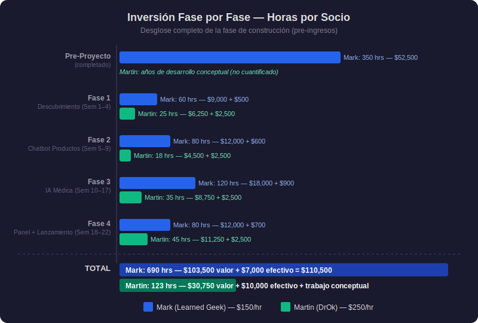
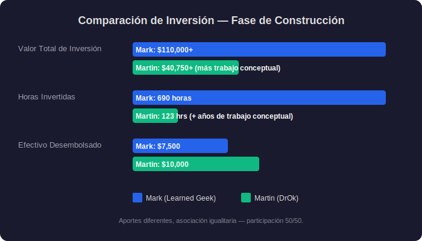
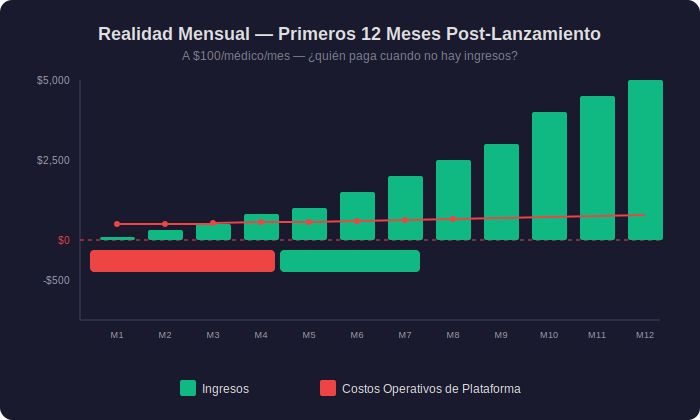
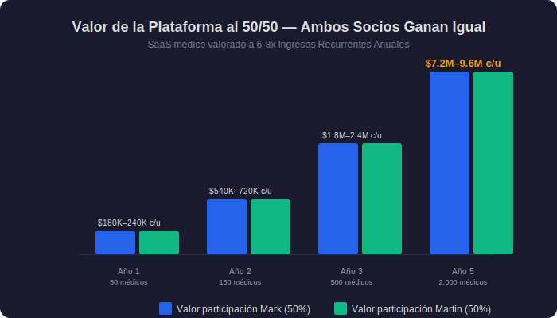

# Respuesta a Martin — 30 de marzo de 2026
## Respuesta a sus comentarios sobre la hoja de términos

**De:** Mark McArthey (markm@learnedgeek.com)
**Para:** Martin Nunez
**Asunto:** Re: Asociación DrOk — Avanzando Juntos

---

Martin,

Gracias por tu respuesta tan reflexiva. Aprecio que te hayas tomado el tiempo de revisar todo con cuidado y compartir tu perspectiva honesta. Esta es exactamente el tipo de conversación que necesitamos tener — abierta y directamente — antes de formalizar cualquier cosa.

Pediste sincerar la inversión completa y armar un Gantt que nos permita fasear el proceso. Tienes toda la razón — ambos debemos tener transparencia total antes de cerrar cualquier acuerdo. Permíteme empezar por donde estamos de acuerdo y construir desde ahí.

---

## 1. Donde Ya Estamos de Acuerdo

**Carlos:** Estamos de acuerdo. Carlos será compensado justamente por su invaluable experiencia. ✅

**Asociación:** Ambos queremos que esto funcione. Ambos vemos el potencial. Pediste ver la inversión completa y armar un Gantt — y tienes razón en pedirlo. Lo que sigue es exactamente eso: cada fase, cada tarea, cada hora, cada costo, para ambos.

---

## 2. El Panorama Completo de Inversión

Pediste sincerar la inversión completa y armar un Gantt que nos permita fasear el proceso e inversión. Aquí está — transparencia total para ambas partes.

Una nota sobre cómo valoré nuestro tiempo:

- **Mi trabajo técnico:** `$150/hora` — tarifa estándar para un desarrollador senior full-stack con experiencia en IA y arquitectura en la nube.
- **Tu tiempo:** `$250/hora` — la tarifa de un médico formado en Harvard y Cayetano Heredia con experiencia regulatoria y una red clínica.

Esa tarifa refleja lo que tu tiempo genuinamente vale.

---

### Inversión Pre-Proyecto (Ya Completada)

Antes de que conversáramos sobre una asociación, yo ya había invertido significativamente para hacer posible esta plataforma:

| Trabajo Completado por Mark | Horas | Valor |
|---|---|---|
| Investigación de seguridad en IA y taxonomía de confabulación (proyecto ANI) | 120 | $18,000 |
| Prueba de concepto funcional (Twilio + Claude API + PubMed) | 100 | $15,000 |
| Redacción de documentos legales (NDA, DPA, SOW, Acuerdo Operativo) | 50 | $7,500 |
| Investigación regulatoria (Ley 29733, DIGEMID, Ley 32314) | 40 | $6,000 |
| Decisiones de arquitectura y evaluación de proveedores | 40 | $6,000 |
| **Subtotal — pre-proyecto de Mark** | **350 hrs** | **$52,500** |
| **Efectivo desembolsado** (hosting, APIs, seguros, herramientas legales) | | **$4,300** |

Tus aportes durante este período — años de desarrollo del concepto, conversaciones con operadores y la visión clínica que impulsa este proyecto — son fundamentales. Ese trabajo no cabe en una tabla de horas, y no creo que sea justo intentar reducirlo a un número. Lo que sí puedo decir es esto: tus años de persistencia son la razón por la que este proyecto existe. Las tablas a continuación capturan lo que podemos medir, pero no capturan todo.

Mi inversión pre-proyecto ya está hecha — independientemente de lo que decidamos. No te estoy pidiendo que la pagues. Pero es parte del panorama completo.

---

### Fase 1 — Descubrimiento y Especificación (Semanas 1–4)

| Entregables de Mark | Hrs | Entregables de Martin | Hrs |
|---|---|---|---|
| Mapeo de requerimientos y diagramas de flujo de datos | 15 | Requerimientos clínicos y flujo de trabajo médico | 8 |
| Configuración de arquitectura en la nube (Azure) | 12 | Definición de protocolos de emergencia | 6 |
| Finalización del marco legal | 10 | Orientación regulatoria (DIGEMID, Ley 29733) | 5 |
| Documentación de cumplimiento | 8 | Documentación de productos (catálogo Infanzia) | 4 |
| Diseño de arquitectura de seguridad | 8 | Revisión y retroalimentación de especificaciones técnicas | 2 |
| Configuración de pipeline CI/CD | 7 | | |
| **Subtotal** | **60 hrs** | **Subtotal** | **25 hrs** |
| Valor: $9,000 + $500 efectivo | | Valor: $6,250 + $2,500 efectivo | |

---

### Fase 2 — Chatbot de Productos Infanzia (Semanas 5–9)

| Entregables de Mark | Hrs | Entregables de Martin | Hrs |
|---|---|---|---|
| Sistema de ingesta de base de conocimientos | 20 | Contenido y documentación del catálogo de productos | 6 |
| Motor de conversación por WhatsApp | 20 | Revisión clínica de respuestas de IA | 5 |
| Integración con Twilio y gestión de mensajes | 15 | Escenarios de pruebas de aceptación (UAT) | 4 |
| Interfaz de administración (Blazor) | 15 | Retroalimentación y correcciones | 3 |
| Pruebas y despliegue | 10 | | |
| **Subtotal** | **80 hrs** | **Subtotal** | **18 hrs** |
| Valor: $12,000 + $600 efectivo | | Valor: $4,500 + $2,500 efectivo | |

---

### Fase 3 — Sistema de Triaje Médico con IA (Semanas 10–17)

Este es el núcleo técnico de la plataforma — donde tanto la ingeniería como la experiencia clínica son más críticas.

| Entregables de Mark | Hrs | Entregables de Martin | Hrs |
|---|---|---|---|
| Modelo de datos y capa de API | 25 | Lista de palabras clave de emergencia (términos médicos en español) | 10 |
| Motor de conversación (integración con Claude API) | 20 | Protocolos de validación clínica | 9 |
| Sistema de detección de emergencias | 15 | Revisión y pruebas de precisión de triaje | 7 |
| PubMed RAG (recuperación de literatura médica) | 15 | Diseño del flujo de incorporación de médicos | 5 |
| VoBo — flujo de aprobación médica | 15 | Escenarios de casos clínicos de prueba | 4 |
| Manejo de imágenes y almacenamiento seguro | 10 | | |
| Capa de encriptación y seguridad | 10 | | |
| Pruebas de integración | 10 | | |
| **Subtotal** | **120 hrs** | **Subtotal** | **35 hrs** |
| Valor: $18,000 + $900 efectivo | | Valor: $8,750 + $2,500 efectivo | |

---

### Fase 4 — Panel de Control Médico y Lanzamiento (Semanas 18–22)

| Entregables de Mark | Hrs | Entregables de Martin | Hrs |
|---|---|---|---|
| Panel de control médico (aplicación web) | 25 | UAT con escenarios clínicos reales | 14 |
| Sistema de gestión de cola | 15 | Configuración piloto (Martin como primer médico) | 10 |
| Historial de pacientes y visor de transcripciones | 15 | Reclutamiento de médicos (primeros 5–10) | 10 |
| Despliegue a producción y monitoreo | 10 | Materiales de incorporación para médicos | 6 |
| Lista de verificación de lanzamiento y auditoría de seguridad | 8 | Trámites regulatorios (si se requieren) | 5 |
| Configuración de SSL/TLS, dominio y DNS | 7 | | |
| **Subtotal** | **80 hrs** | **Subtotal** | **45 hrs** |
| Valor: $12,000 + $700 efectivo | | Valor: $11,250 + $2,500 efectivo | |

---

### Post-Lanzamiento — Operaciones Continuas Año 1

Después del lanzamiento, ambos seguimos contribuyendo. La plataforma no funciona sola.

| Responsabilidades Continuas de Mark | Hrs/Año | Responsabilidades Continuas de Martin | Hrs/Año |
|---|---|---|---|
| Monitoreo y disponibilidad de la plataforma (24/7) | 100 | Reclutamiento e incorporación de médicos | 80 |
| Parches y actualizaciones de seguridad | 80 | Validación clínica de respuestas de IA | 60 |
| Corrección de errores y desarrollo de funcionalidades | 120 | Navegación regulatoria y cumplimiento | 30 |
| Gestión de base de datos y respaldos | 60 | Desarrollo de marca y marketing | 30 |
| Gestión y optimización de costos de API | 40 | Expansión de red | 25 |
| Actualizaciones de cumplimiento | 40 | Actualización de protocolos médicos | 15 |
| Mantenimiento y renovación de seguros | 20 | | |
| Gestión de servidor e infraestructura | 60 | | |
| **Total Año 1** | **~520 hrs** | **Total Año 1** | **~240 hrs** |
| Valor: ~$78,000 + ~$6,000 efectivo | | Valor: ~$60,000 | |

---

### Resumen Completo de Inversión — Fase de Construcción (Pre-Ingresos)

| Fase | Horas Mark | Valor Mark | Horas Martin | Valor Martin |
|---|---|---|---|---|
| Pre-Proyecto (completado) | 350 | $52,500 | — | — |
| Fase 1 — Descubrimiento | 60 | $9,000 | 25 | $6,250 |
| Fase 2 — Chatbot de Productos | 80 | $12,000 | 18 | $4,500 |
| Fase 3 — Sistema de IA Médica | 120 | $18,000 | 35 | $8,750 |
| Fase 4 — Panel de Control y Lanzamiento | 80 | $12,000 | 45 | $11,250 |
| **Total fase de construcción** | **690** | **$103,500** | **123** | **$30,750** |

*Los años de trabajo conceptual y visión clínica de Martin durante el pre-proyecto no están incluidos en esta tabla — son fundamentales para el proyecto pero no se reducen a un número.*

| | Mark (Learned Geek) | Martin (DrOk) |
|---|---|---|
| **Horas en fase de construcción** | 690 horas | 123 horas + años de trabajo conceptual |
| **Valor de mercado del tiempo** | $103,500 (a $150/hr) | $30,750 (a $250/hr) |
| **Efectivo desembolsado** | $7,000 | $10,000 (en fases) |
| **Inversión total pre-ingresos** | **$110,500** | **$40,750 + trabajo conceptual** |

La naturaleza de nuestros aportes es diferente — y esa es la fortaleza de esta asociación. El mío es principalmente construcción técnica y operaciones continuas. El tuyo es principalmente experiencia clínica, navegación regulatoria y crecimiento comercial. Ambos son esenciales.

---

## 3. Ingresos — La Realidad Práctica

Entiendo y estoy de acuerdo con el principio de reinversión. Hacer crecer el negocio debería ser absolutamente la prioridad. Pero quiero repasar cómo se ven realmente los primeros 12 meses financieramente, porque aquí es donde los números se ponen reales:

### Realidad de Efectivo Mensual — Primeros 12 Meses Post-Lanzamiento

| Mes | Médicos (est.) | Ingresos | Costos Plataforma | Neto Disponible | ¿Quién Paga el Déficit? |
|---|---|---|---|---|---|
| 1 | 1 (Martin) | $100 | $500 | **-$400** | Mark (de su bolsillo) |
| 2 | 3 | $300 | $500 | **-$200** | Mark (de su bolsillo) |
| 3 | 5 | $500 | $525 | **-$25** | Mark (de su bolsillo) |
| 4 | 8 | $800 | $550 | +$250 | Primer mes positivo |
| 5 | 10 | $1,000 | $550 | +$450 | |
| 6 | 15 | $1,500 | $600 | +$900 | |
| 7-9 | 20-25 | $2,000-2,500 | $625-650 | +$1,375-1,850 | |
| 10-12 | 30-50 | $3,000-5,000 | $650-725 | +$2,350-4,275 | |

**Durante los primeros 3-4 meses, no hay ingresos para reinvertir.** La plataforma cuesta dinero ya sea que haya 0 médicos o 100. Esos costos necesitan cubrirse de algún lugar mientras crecemos.

Por eso propuse una recuperación mínima de costos (tarifa de licencia de plataforma) que se deduce primero antes de cualquier reinversión: simplemente asegura que la plataforma siga funcionando. No es ganancia — es la factura de luz.

**Mi propuesta:** Acordamos una recuperación mínima mensual de costos operativos (aproximadamente $500-700/mes) que cubra los costos reales de infraestructura. Todo por encima de eso, lo reinvertimos tan agresivamente como ambos acordemos que tenga sentido. Una vez que los ingresos superen consistentemente los costos, podemos ajustar o eliminar la recuperación de costos y pasar a distribución pura de utilidades.

---

## 4. Participación — Mi Propuesta

Martin, he pensado en esto con cuidado. Mi propuesta original era 55/45 a mi favor. Tu contraoferta fue 60/40 a tu favor. Estamos a 20 puntos de distancia.

Esto es lo que me gustaría proponer: **50/50. Socios verdaderamente iguales.**

No porque los números digan 50/50 — los números arriba hablan por sí solos. Sino porque creo en lo que estamos construyendo, y creo que el éxito de este proyecto depende **igualmente** de ambos.

**Tú no eres "solo una herramienta comercial."** Quiero ser muy claro en eso. Tú eres:
- La autoridad clínica en la que los médicos confían
- La persona que navegó DIGEMID y la Ley 29733
- La persona que trajo a Carlos Rojas a la mesa
- La persona con acceso a 50-100 médicos desde el día uno
- El graduado de Harvard y Cayetano Heredia cuya reputación abre puertas
- El médico que validará cada respuesta de IA antes de que llegue a un paciente

Ninguno de los dos puede hacer esto solo. La plataforma sin médicos es una demostración tecnológica. La visión clínica sin una plataforma se queda sin realizar. **Juntos, hacemos algo que ninguno puede construir por separado. Eso es lo que significa 50/50.**

---

## 5. Cómo Estamos Protegidos Ambos — Vesting, Salvaguardas y Compromiso

Participación igualitaria requiere protecciones igualitarias. Una asociación justa significa que ninguno de los dos puede perderlo todo si algo sale mal. Quiero proponer protecciones estructurales que nos protejan a **ambos** por igual:

### Vesting de Participación — Compromiso de Ambas Partes

En lugar de otorgar 50% a cada persona desde el día uno, la participación se consolida durante **24 meses con un periodo de prueba (cliff) de 6 meses.**

Lo que esto significa en la práctica:

| Plazo | Qué Sucede |
|---|---|
| **Meses 1–6 (cliff)** | Ninguno de los socios tiene participación consolidada. Ambos estamos demostrando compromiso. |
| **Mes 6** | Cada socio consolida el 25% de su participación total (12.5% de la empresa cada uno). |
| **Meses 7–24** | La participación restante se consolida mensualmente — aproximadamente 1.4% por mes por socio. |
| **Mes 24** | Ambos socios están completamente consolidados al 50/50. |

**Por qué esto te protege a ti, Martin:** Si yo dejo de construir o mantener la plataforma durante los primeros dos años, no me voy con el 50% de un negocio que abandoné. Tú conservas tu participación consolidada y el derecho de buscar otro socio técnico.

**Por qué esto me protege a mí:** Si el reclutamiento de médicos no se materializa o la asociación no funciona, no habré cedido la mitad de la plataforma sin que el lado comercial haya entregado resultados.

**Por qué es justo:** Requiere que ambos nos presentemos y cumplamos. Ninguno de los dos gana participación por firmar un contrato — la ganamos haciendo el trabajo.

### Salvaguardas de la Plataforma — Tu Inversión Está Protegida

La verdadera pregunta no es "¿quién es dueño del código?" — es **"¿qué pasa con mi inversión si algo sale mal?"** Así es como la estructura resuelve eso:

| Escenario | Qué Sucede | Quién Está Protegido |
|---|---|---|
| **Mark deja de mantener la plataforma** | La licencia exclusiva a DrOk se vuelve perpetua e irrevocable; el código fuente en custodia (escrow) se libera a DrOk | Martin |
| **Martin deja de reclutar médicos** | El período de exclusividad caduca; Learned Geek puede licenciar a otros socios | Mark |
| **Alguien quiere adquirir la plataforma** | Ambos socios tienen derecho de primera opción; no hay venta sin acuerdo mutuo | Ambos |
| **Un socio quiere salir** | El socio restante tiene derecho de primera opción sobre la participación del socio que se va | Ambos |
| **Desacuerdo sobre dirección** | 50/50 requiere consenso — ningún socio puede imponer decisiones unilateralmente | Ambos |

### Metas de Desempeño — Responsabilidad para Ambos

| Meta | Plazo | Responsable |
|---|---|---|
| MVP funcional desplegado | Mes 6 | Mark |
| Martin incorporado como médico piloto | Mes 6 | Ambos |
| 10 médicos activos | Mes 12 | Martin |
| 25 médicos activos | Mes 18 | Martin |
| Disponibilidad de plataforma > 99.5% | Continuo | Mark |
| Todos los parches de seguridad al día | Continuo | Mark |

Si las metas de reclutamiento de médicos no se cumplen, se renegocia el acuerdo de exclusividad — no la participación. Si las metas de la plataforma no se cumplen, aplica lo mismo. Ambos somos responsables de cumplir con lo que nos comprometimos.

---

## 6. Propiedad Intelectual — Una Decisión Operativa

Con esas protecciones establecidas, permíteme abordar la pregunta que sé que más te importa.

Quiero empezar diciendo claramente: **esta idea es tuya.** Tú la concebiste. Has estado trabajando en ella desde antes de la pandemia. La perseguiste a través de múltiples enfoques y seguiste avanzando. Esa visión — un asistente médico con IA que ayuda a los pacientes cuando el doctor no está disponible — esa es tu contribución, y la respeto profundamente. Sin tu idea y tu visión, no estaríamos teniendo esta conversación.

Bajo la ley estadounidense y la ley peruana, la protección de propiedad intelectual se aplica a la **implementación** — el código, la arquitectura, la investigación, la documentación — no al concepto o idea. El Decreto Legislativo 822 de Perú y la reciente Ley 32314 (2025) son explícitos en este punto, al igual que la ley de derechos de autor de EE.UU. Esta es la realidad legal en ambos países.

**Pero no quiero que esto sea un argumento legal. Quiero que sea uno práctico.**

Alguien tiene que mantener esta plataforma todos los días. Mira lo que implica durante la vida de este proyecto:

| Responsabilidad Continua | Quién Lo Hace | Frecuencia |
|---|---|---|
| Hosting y disponibilidad del servidor | Mark / Learned Geek | 24/7/365 |
| Parches y actualizaciones de seguridad | Mark / Learned Geek | Semanal |
| Corrección de errores (incluyendo emergencias a las 2am) | Mark / Learned Geek | Continuo |
| Costos de API de IA (Anthropic, PubMed) | Mark / Learned Geek | Mensual |
| Costos de mensajería (Twilio/WhatsApp) | Mark / Learned Geek | Mensual |
| Seguro de responsabilidad profesional | Mark / Learned Geek | Anual |
| Seguro de responsabilidad cibernética | Mark / Learned Geek | Anual |
| Desarrollo de funcionalidades y mejoras | Mark / Learned Geek | Continuo |
| Gestión y respaldos de base de datos | Mark / Learned Geek | Diario |
| Actualizaciones de cumplimiento (Ley 29733, ARCO) | Mark / Learned Geek | Según se requiera |

La entidad que mantiene, asegura, protege y opera la plataforma necesita ser la entidad responsable de ella. No se trata de quitarte algo — se trata de asegurar que la plataforma tenga un hogar claro donde alguien sea responsable de mantenerla viva, segura y asegurada todos los días.

**Para ser muy claro: que la propiedad intelectual esté con Learned Geek no significa que la plataforma sea "mía" y no "nuestra."** La plataforma es nuestro negocio. La construimos juntos, la hacemos crecer juntos, compartimos los ingresos y la participación 50/50. La estructura de propiedad intelectual es una decisión operativa — como decidir qué entidad tiene la póliza de seguro o el contrato de hosting en la nube. Tiene que vivir en algún lugar, y tiene sentido que viva con la entidad que hace el trabajo diario de mantenerla.

**Lo que esto te da:** DrOk siempre tiene un producto funcional, seguro y asegurado sin que tú tengas que preocuparte jamás por servidores, parches de seguridad, respaldos o actualizaciones de cumplimiento. Esa es mi responsabilidad y mi compromiso con nuestra asociación. Tú te enfocas en lo que haces brillantemente: la visión clínica, la red de médicos, la navegación regulatoria y el crecimiento de DrOk.

**Lo que no cambia:** Cualquier oportunidad que venga a través de DrOk — a través de tus médicos, tu red, tu mercado — la compartimos proporcionalmente según nuestro acuerdo. Cada dólar de ingresos, cada nuevo mercado, cada oportunidad de expansión — 50/50. La estructura de propiedad intelectual no toca eso. Simplemente asegura que el motor que impulsa todo tenga a alguien responsable de mantenerlo funcionando.

**Y como muestran las salvaguardas arriba:** si yo alguna vez dejo de mantener la plataforma, el código fuente en custodia (escrow) se libera a DrOk y la licencia se vuelve perpetua e irrevocable. No necesitas ser dueño de la propiedad intelectual para estar protegido — la estructura lo garantiza.

---

## El Panorama Financiero — Hacia Dónde Vamos Juntos

Déjame mostrarte hacia dónde estamos construyendo:

### Proyección Año por Año (a `$100`/médico/mes)

| | Año 1 | Año 2 | Año 3 | Año 5 |
|---|---|---|---|---|
| **Médicos** | 50 | 150 | 500 | 2,000 |
| **Ingresos Anuales** | $60,000 | $180,000 | $600,000 | $2,400,000 |
| **Costos Operativos** | $8,000 | $18,000 | $50,000 | $150,000 |
| **Ingresos Netos** | $52,000 | $162,000 | $550,000 | $2,250,000 |
| **Parte de Mark (50%)** | $26,000 | $81,000 | $275,000 | $1,125,000 |
| **Parte de Martin (50%)** | $26,000 | $81,000 | $275,000 | $1,125,000 |

### Valoración de la Plataforma (6-8x ARR — estándar para SaaS médico)

| Médicos | Ingresos Anuales | Valoración Plataforma | 50% de Mark | 50% de Martin |
|---|---|---|---|---|
| 100 | $120,000 | $720K – 960K | $360K – 480K | $360K – 480K |
| 500 | $600,000 | $3.6M – 4.8M | $1.8M – 2.4M | $1.8M – 2.4M |
| 1,000 | $1,200,000 | $7.2M – 9.6M | $3.6M – 4.8M | $3.6M – 4.8M |
| 2,000 | $2,400,000 | $14.4M – 19.2M | $7.2M – 9.6M | $7.2M – 9.6M |

**Con 50/50, cada uno construye la misma riqueza.** Con 2,000 médicos, la participación de cada uno vale 7–10 millones de dólares. La diferencia entre 40% y 50% a esa escala es 1.5–2 millones de dólares. La diferencia entre 50% y 60% es la misma. Lo que más importa es que lo construyamos juntos.

### Realidad de Flujo de Caja Mensual — ¿Quién Paga Cuando No Hay Ingresos?

### Hacia Dónde Vamos — Valor de la Plataforma al 50/50

La inversión no es igual en horas ni en dólares — pero las asociaciones se construyen sobre más que hojas de cálculo. Estoy proponiendo 50/50 porque creo en lo que estamos construyendo juntos.

---

## Lo Que Pido — Resumen

| Tema | Mi Posición |
|---|---|
| **Participación** | 50/50 — socios verdaderamente iguales |
| **Vesting** | 24 meses, cliff de 6 meses — ambos ganamos participación cumpliendo |
| **Protecciones** | Código en custodia (escrow), derecho de primera opción, metas de desempeño — tu inversión está segura |
| **Propiedad Intelectual** | Se queda con Learned Geek — base fundamental de la estructura. Nos protege a ambos. |
| **Carlos** | Asesor — acordado ✅ |
| **Inversión** | $10,000 de Martin en fases — flexible en estructura |
| **Ingresos** | Costos operativos cubiertos primero, luego reinvertir, luego distribuir |
| **Diagrama de Gantt** | Arriba — transparencia total sobre cada fase y tarea |

---

## Lo Que Quiero Que Sepas

No estoy tratando de quitarte nada. No estoy tratando de ganar una negociación. Estoy tratando de construir algo extraordinario contigo — y construirlo sobre una base que dure.

El hecho de que estemos teniendo esta conversación — honestamente, con respeto, de hombre a hombre — me dice que podemos ser grandes socios. No todos pueden tener una conversación difícil y salir más fuertes. Creo que nosotros sí podemos.

Como dije antes: ¿por qué no nosotros?

Avísame qué piensas. Estoy disponible para una llamada cuando quieras conversar.

Un abrazo,

Mark McArthey
Learned Geek LLC
markm@learnedgeek.com

---

*Final — listo para revisión.*
